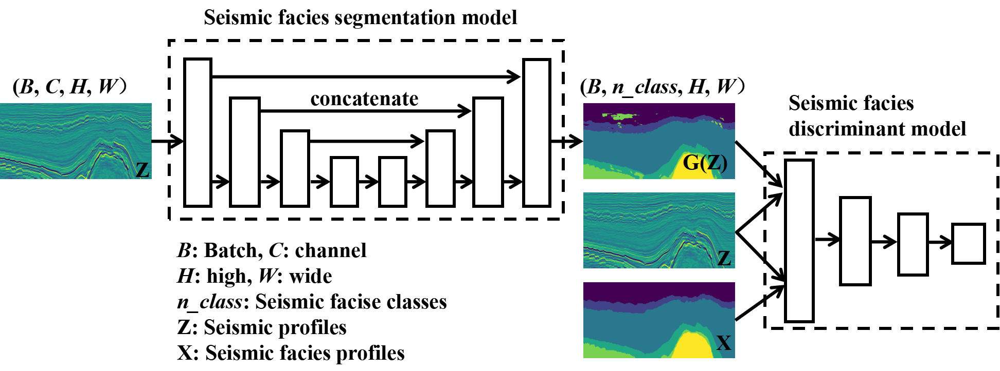

# **DSFA**




### **What is this repository for?**

DSFA is a software for paper 《Discriminator-based Stratigraphic Sequence Semantic Augmentation Seismic Facies Analysis》.


### Who do I talk to?

Yu Sun
a. School of Earth Sciences, Northeast Petroleum University, Daqing 163318, China;
b. National Key Laboratory of Continental Shale Oil, Northeast Petroleum University, Daqing, Heilongjiang 163318, China

E-mail: [191981070190@nepu.edu.cn](mailto:191981070190@nepu.edu.cn;);


### Usage

1、Download the F3 or Parihaka dataset from the provided link.

​		F3: https://zenodo.org/record/3755060/files/data.zip

​		Parihaka: https://public.3.basecamp.com/p/JyT276MM7krjYrMoLqLQ6xST

2、Place the downloaded seismic data and seismic facies labeling data in the data/ directory with the specified names

​		F3 label: `data/F3/train/train_labels.npy`

​		F3 seismic: `data/F3/train/train_seismic.npy`

​		Parihaka label: `data/NZPM/train/train_labels.npy`

​		Parihaka seismic: `data/NZPM/train/train_seismic.npy`

3、Use `setting.py` to set the hyperparameters.

4、Train the DSFA model using `train_U_D.py`.

5、Test the DSFA model using `test_test.py` to generate seismic facies analysis results for each seismic section.

6、Calculate the test accuracy and generate the confusion matrix using `show_result.py`.


### **code introduction**

```
1、train_U.py test object:
	U_loss: ['cross_entropy', 'DiceLoss', 'Focal_Loss']
	U_skip: ['noskip', 'skip']
	
2、train_U_D.py test object:
	The loss function is determined as Focal_Loss and the connection mode as skip in train_U.py. 
	This training primarily demonstrates the improvement brought by the discriminator to the model.

3、test_test.py
	The test target is separated from the training set. The test accounts for 15/16. 
	The test data is stored in the split file and the test accuracy is calculated.

4、show_result.py
	Visualizes the confusion matrix.
	
5、dataset.py
	Obtains the dataset.
	
6、data:
	Stores the raw dataset.
	data/F3/train/train_labels.npy and data/F3/train/train_seismic.npy
	download link: https://zenodo.org/record/3755060/files/data.zip
	
7、model:
	Stores the model-related code.
	
8、save_train_models:
	Stores the trained models.
	
9、test_fig:
	Stores seismic profiles and seismic facies profiles during the testing process.
	
10、setting.py
	Hyperparameter setting	

11、model setting
	（1）、generator = modelG.GeneratorUNet                 ： Unet
	（2）、generator = modelG.GeneratorUNet_noskip          ： Unet w/o skip
	（3）、generator = modelG.GeneratorUNet                 ： Unet w/ D
	      discriminator = modelG.Discriminator             :  Discriminator

The geological body identification module focuses on a specific seismic facies within a particular stratigraphic interval in seismic data, 
treating other seismic facies as background. Compared to seismic facies identification, 
geological body identification merges the facies classification results of each seismic profile to form a single body. 
It then proceeds with seismic geomorphology analysis.
```

